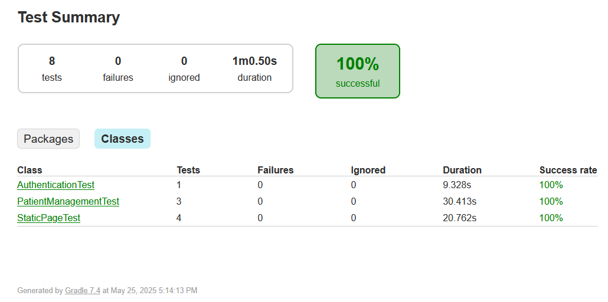

# Selenium big assignment

Selenium tests for the [OpenMRS demo application](https://o2.openmrs.org)



> The website resets periodically. I tried to overcome this by interacting with a sample user but some tests might still fail after a reset.

## How to run

Docker and docker compose (v2) is needed. I tested on WSL Ubuntu 2204.

1. Launch the docker containers

    ```bash
    docker compose up -d
    ```

    Once running, the GUI of the test runner can be followed at [http://localhost:8081](http://localhost:8081)

1. Exec into the ubuntu container:

    ```bash
    docker exec -it selenium-assignment-ubuntu-1 bash
    ```

1. Inside the container, change directory and run the tests

    ```bash
    cd /home/selenium/tests
    gradle test
    ```

1. After the tests ran successfully, the containers can be shut down with the following command, from outside of the container:

    ```bash
    docker compose down
    ```
